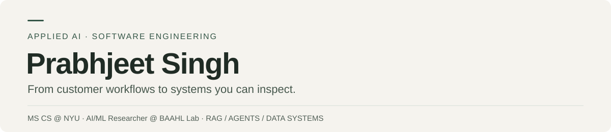

  

  <a href="https://github.com/prabhjeet2570-spec?tab=repositories">Explore my repositories</a>

## Hey, I'm Prabhjeet 👋

I'm a software engineer who enjoys building things with AI, from agents that can use tools to apps that help people make sense of a lot of information. I work across the stack and like seeing an idea through—from an experiment in a notebook to a backend and an interface someone can actually use.

I'm interested in **AI agents, retrieval-augmented generation (RAG), multimodal models, model fine-tuning, and data engineering**. Some projects here are applications; others are experiments where I wanted to understand how a model behaves and what makes it better.

## What I've been building

| Project | The idea | Built with |
| :--- | :--- | :--- |
| **[Huddle](https://github.com/prabhjeet2570-spec/huddle)** | Describe a study session, find a room, and review an AI-assisted booking before confirming it. A local demo that also handles booking conflicts and calendar failures. | Python · FastAPI · LangGraph · PostgreSQL |
| **[SEC Filing Atlas](https://github.com/prabhjeet2570-spec/secfilingatlas)** | Search company filings, compare document versions, and follow explanations back to the original text in one research workspace. | React · TypeScript · FastAPI · SQLite FTS5 |
| **[SmolVLM ScienceQA](https://github.com/prabhjeet2570-spec/smolvlm-scienceqa-dora)** | Teach a small vision-language model to answer science questions using images, with DoRA fine-tuning, data augmentation, and ensembling. | PyTorch · Hugging Face · PEFT |
| **[AeroStreamAnalytics](https://github.com/prabhjeet2570-spec/aerostream-analytics)** | Bring aircraft tracking and historical flight analysis into an aviation dashboard using streaming and batch data pipelines. | Python · Kafka · PySpark · Flask |
| **[Music Language Models](https://github.com/prabhjeet2570-spec/Scaling-Laws-for-Language-Models-on-Symbolic-Music-Data)** | Explore what happens as transformers and LSTMs get bigger when they're trained on symbolic music instead of ordinary text. | PyTorch · Transformers · ABC notation |

## What I enjoy working on

I'm drawn to agents that can do something useful with tools, RAG systems that keep answers connected to their sources, and smaller models that can be adapted to a specific task. I also enjoy the software around them: APIs, databases, data pipelines, and interfaces that make the whole thing easier to use.

I like being able to run an experiment, look at what worked and what didn't, and use that to decide what to build next.

## My toolkit

**Languages:** Python, TypeScript, JavaScript, SQL  
**Web & backend:** React, FastAPI, PostgreSQL, SQLite  
**AI & data:** PyTorch, Hugging Face, LangGraph, PEFT, LoRA / DoRA, Kafka, PySpark  
**Development:** Docker, Git, GitHub Actions
